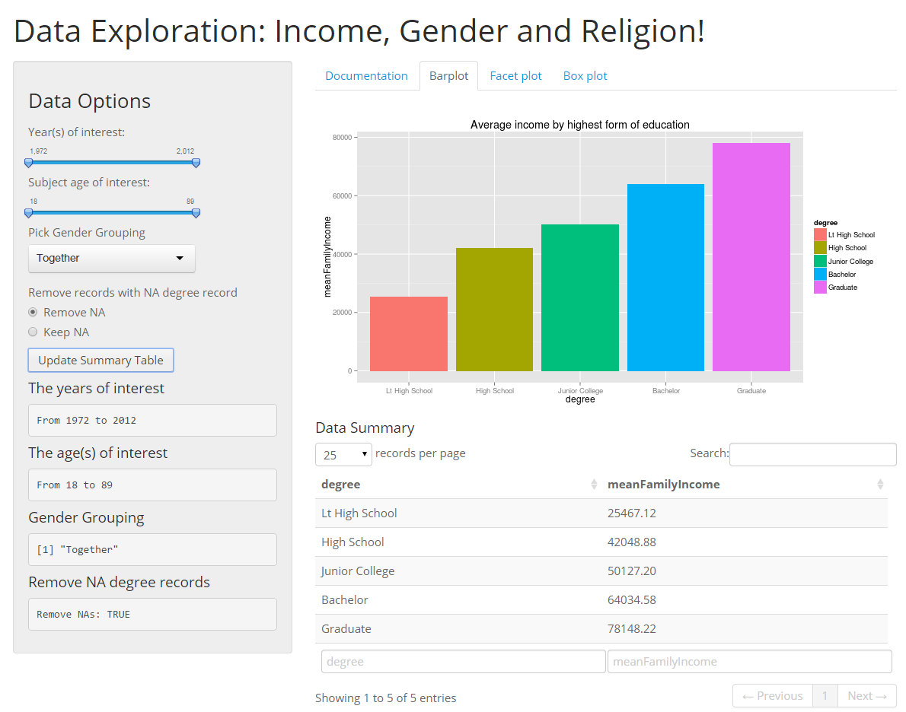

<style>
.title-slide { background-color: #186DB6;}
.title-slide hgroup > h1{ font-family: 'Helvetica', 'Helvetica', sanserif; }
.title-slide hgroup > h1 { color: #FABF29; } 
.title-slide hgroup > h2 { color: #dfdfdf }
.title-slide hgroup > p { color: #dfdfdf ;}
</style>

## The app!

Free to use and runs right in the browser!

Intro            |  Explore the average US incomes! | Explore trends in time | Group the data! 
:-------------------------:|:-------------------------:|:-------------------------:|:-------------------------:
 |   |  | 


Grab it here: [https://sepanda.shinyapps.io/ShinyApp/](https://sepanda.shinyapps.io/ShinyApp/)


Check out the source code:   

[https://github.com/sepanda/DevelopingDataProducts/tree/master/ShinyApp](https://github.com/sepanda/DevelopingDataProducts/tree/master/ShinyApp)

--- .class #id 


## Looking through data for everyone.

Some questions are asked by many people and instead of turning to data, they leave the question unanswered. 

That's not a surprise when faced with learning a new skill like R.


```r
library(car); library(dplyr);
data(States); States_tbl <- tbl_df(States)
States_tbl %>% group_by(region) %>% select(pay) %>% summarize(avgTeachPay=mean(pay*1e3)) %>% t
```

```
##             [,1]    [,2]    [,3]    [,4]    [,5]    [,6]    [,7]   
## region      "ENC"   "ESC"   "MA"    "MTN"   "NE"    "PAC"   "SA"   
## avgTeachPay "33800" "27000" "38667" "28000" "34333" "35800" "31778"
##             [,8]    [,9]   
## region      "WNC"   "WSC"  
## avgTeachPay "27000" "25250"
```


--- .class #id 

## Friendly to use.

You don't need any technical skills for this shiny app, just a little curiosity.

 


Learn a little more about the change in availanle family income with respect to time, age, gender, religion, and highest attained degree.


--- .class #id 

## Thanks!

Thanks for your time.

That app:
[https://sepanda.shinyapps.io/ShinyApp/](https://sepanda.shinyapps.io/ShinyApp/)

My github:
[https://github.com/sepanda](https://github.com/sepanda)

More about me:
- [sepanda.com/About](http://sepanda.com/about/)
- [linkedIn](http://linkedin.com/in/sepandapouryahya/)


Want to make your own shiny app? 
* [The R Project for Statistical Computing](http://www.r-project.org/)
* [Rstudio](http://www.rstudio.com/)
* [Github](http://www.github.com/)
* [Coursera](http://www.coursera.org)

